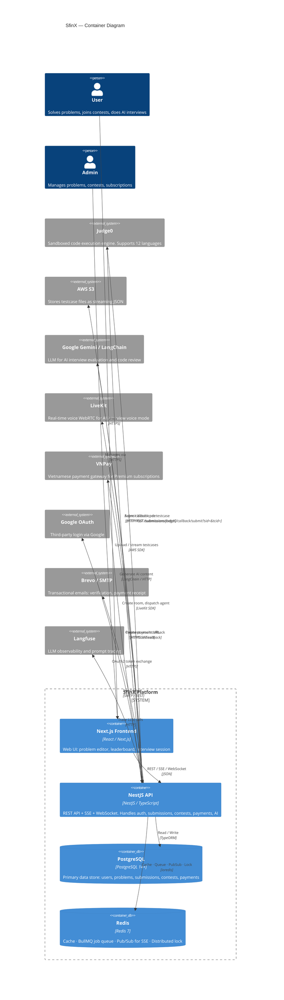
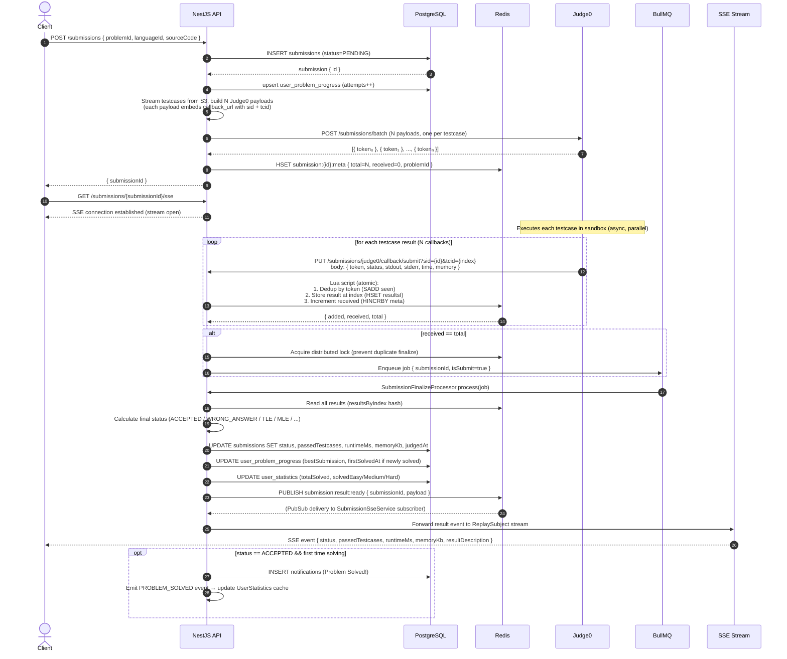
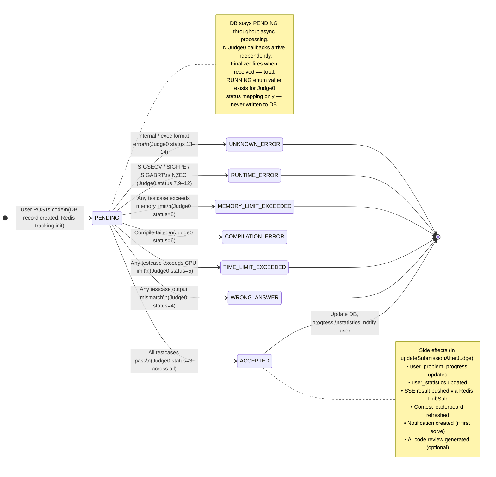
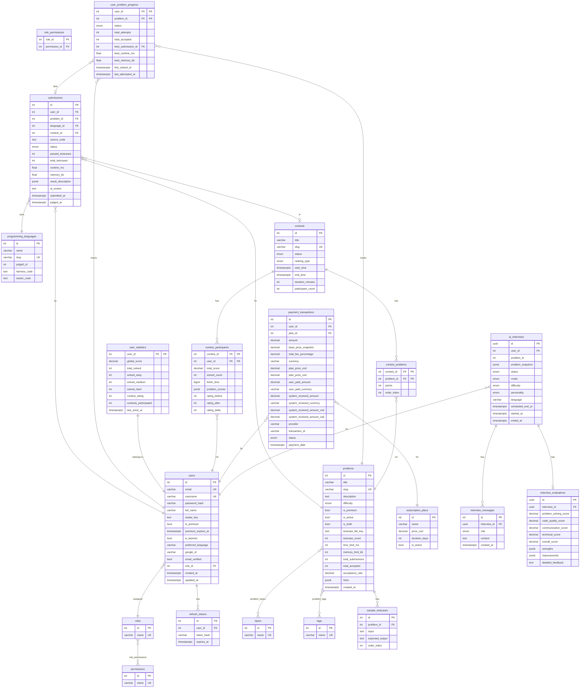

# SfinX Backend

> A LeetCode-style competitive programming platform — NestJS · PostgreSQL · Redis · Judge0

**API**: `http://localhost:3000/api` | **Swagger**: `http://localhost:3000/api/docs`

---

## Table of Contents

1. [Overview](#overview)
2. [Tech Stack](#tech-stack)
3. [Architecture — C4 Container Diagram](#architecture--c4-container-diagram)
4. [Code Submission Flow — Sequence Diagram](#code-submission-flow--sequence-diagram)
5. [Submission Lifecycle — State Machine](#submission-lifecycle--state-machine)
6. [Database Schema — ERD](#database-schema--erd)
7. [Module Breakdown](#module-breakdown)
8. [Quick Start](#quick-start)
9. [Key Technical Highlights](#key-technical-highlights)

---

## Overview

**SfinX** is a full-featured online judge platform built from scratch as a graduation thesis project. Users can:

- Solve algorithmic problems with **automatic grading** (12 languages via Judge0)
- Compete in **real-time contests** (ACM / IOI ranking)
- Practice **AI mock interviews** with voice support (LiveKit + Google Gemini)
- Discuss and share solutions in a **community forum**
- Subscribe to **Premium** via VNPay for exclusive content

---

## Tech Stack

| Layer              | Technology                                              |
| ------------------ | ------------------------------------------------------- |
| **Framework**      | NestJS 11.x (TypeScript 5.7, strict mode)               |
| **Database**       | PostgreSQL 14+ · TypeORM 0.3.x · 59 migrations          |
| **Cache / Queue**  | Redis 7.x · BullMQ 5.x · Lua scripts                    |
| **Auth**           | JWT RS256 (Access + Refresh) · Google OAuth · CASL RBAC |
| **Code Execution** | Judge0 API (self-hosted or cloud)                       |
| **AI**             | Google Gemini · LangChain · Langfuse tracing            |
| **Voice**          | LiveKit WebRTC                                          |
| **Storage**        | AWS S3 (testcase files, streaming JSON parse)           |
| **Payment**        | VNPay (HMAC verification)                               |
| **Email**          | Brevo / SMTP (Handlebars templates)                     |
| **DevOps**         | Docker Compose · GitHub Actions CI/CD · Husky           |

---

## Architecture — C4 Container Diagram



---

## Code Submission Flow — Sequence Diagram

This diagram covers the full async journey from a user clicking **Submit** to receiving the result via SSE.



---

## Submission Lifecycle — State Machine



---

## Database Schema — ERD

Core tables and their relationships. Full history is tracked across **59 migration files**.



---

## Module Breakdown

| Module                   | Responsibility                                                              |
| ------------------------ | --------------------------------------------------------------------------- |
| **auth**                 | JWT login/register, Google OAuth, password reset, email verification        |
| **submissions**          | Code submission pipeline, test run, SSE result streaming, AI code review    |
| **problems**             | CRUD, full-text search, testcase upload to S3, sample testcases             |
| **contest**              | Contest lifecycle, leaderboard (ACM/IOI), ELO rating update                 |
| **ai-interviews**        | AI mock interview sessions, voice via LiveKit, evaluation via Gemini        |
| **ai**                   | LangChain service, prompt config management (DB-driven, no redeploy needed) |
| **payments**             | VNPay integration, subscription management, revenue analytics               |
| **judge0**               | Judge0 HTTP client, callback controller, result parsing                     |
| **rbac**                 | Roles, permissions, CASL ability factory                                    |
| **redis**                | CacheService, PubSubService, LockService, RateLimiterService                |
| **discuss**              | Posts, comments, voting                                                     |
| **solutions**            | Editorial solutions, voting, editorial flag                                 |
| **notifications**        | In-app notifications with i18n (EN/VI)                                      |
| **study-plans**          | Curated problem lists with enrollment tracking                              |
| **favorite-list**        | User-created and saved problem collections                                  |
| **admin**                | Platform statistics dashboard, revenue chart, churn analysis                |
| **programming-language** | Supported languages, Judge0 IDs, harness code templates                     |
| **system-config**        | Runtime system parameters (DB-driven feature flags)                         |

---

## Quick Start

### Prerequisites

- Node.js 18+ or **Bun**
- PostgreSQL 14+
- Redis 7+
- Judge0 instance (self-hosted or cloud)

### 1. Install & configure

```bash
bun install
cp .env.example .env
# Fill in DB_*, JWT_*, JUDGE0_*, AWS_*, REDIS_* variables
```

### 2. Database setup

```bash
createdb sfinx
bun run migration:run   # Run all 59 migrations
bun run seed:run        # Seed roles, languages, problems, plans
```

### 3. Run

```bash
bun run start:dev
```

### Scripts

```bash
bun run migration:run      # Apply pending migrations
bun run migration:revert   # Rollback last migration
bun run seed:run           # Seed reference data
bun run build              # Production build
bun test                   # Unit tests
bun test:e2e               # E2E tests
bun run lint               # ESLint
```

---

## Key Technical Highlights

| #   | Problem                                                             | Solution                                                                                            |
| --- | ------------------------------------------------------------------- | --------------------------------------------------------------------------------------------------- |
| 1   | Race condition when multiple Judge0 callbacks arrive simultaneously | **Lua script atomic** (dedup + index store in one Redis transaction) + **RedLock** distributed lock |
| 2   | Real-time submission result delivery without polling                | **SSE** + **Redis Pub/Sub** pipeline                                                                |
| 3   | Large testcase files (thousands of lines)                           | **Streaming JSON parse** (`stream-json`) from S3                                                    |
| 4   | AI interviewer needs to see user's code                             | **Code snapshot mechanism** injected into LLM prompt context                                        |
| 5   | Prevent double-finalization of a submission                         | BullMQ job dedup + distributed lock                                                                 |
| 6   | LLM prompt changes without redeployment                             | **PromptConfig** stored in DB, cached in Redis                                                      |
| 7   | Fine-grained access control (ownership, premium, role)              | **CASL** ability-based authorization + DB-backed role/permission system                             |
| 8   | Contest leaderboard updates in real-time                            | SSE stream + Redis cache invalidation on every accepted submission                                  |
| 9   | Admin churn rate analytics                                          | SQL anti-join with window functions                                                                 |
| 10  | Full schema history and safe migrations                             | 59 **TypeORM migration files** with up/down support                                                 |

---

## Further Reading

- [`docs/PROJECT_OVERVIEW.md`](docs/PROJECT_OVERVIEW.md) — Full Vietnamese project overview for thesis defence
- [`docs/CASL_RBAC_GUIDE.md`](docs/CASL_RBAC_GUIDE.md) — Authorization system guide
- [`docs/NOTIFICATION_SYSTEM.md`](docs/NOTIFICATION_SYSTEM.md) — Notification architecture
- [`docs/REDIS_USAGE.md`](docs/REDIS_USAGE.md) — Redis usage patterns

---

**License**: UNLICENSED (academic project)
